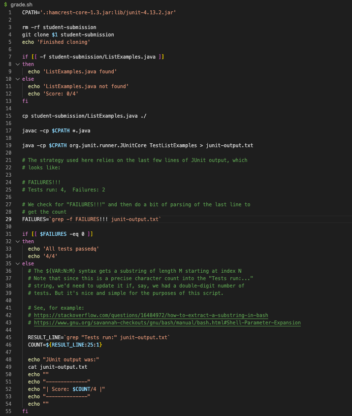
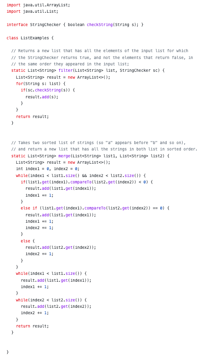
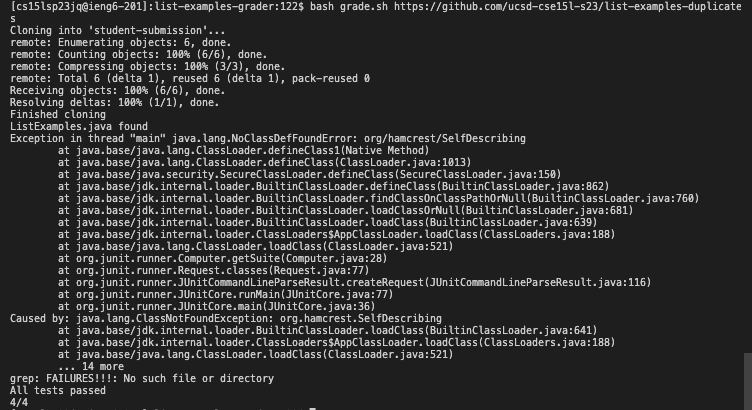
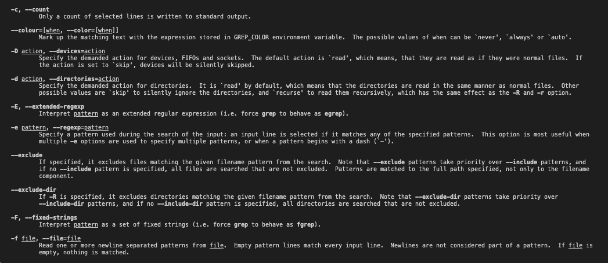

# Part 1: Debugging Scenario
## Student's Post:   
**What environment are you using (computer, operating system, web browser, terminal/editor, and so on)?**   
I am coding on the VisualStudioCode terminal on a MacBook.   
**Detail the symptom you're seeing. Be specific; include both what you're seeing and what you expected to see instead. Screenshots are great, copy-pasted terminal output is also great. Avoid saying “it doesn't work”.**   
When testing the grading script using the ListExamples file, the output says that all the tests have passed, but also gives an error message. I did not edit the ListExamples file, so I do not think that the error is coming from there, but rather my grading script. Here are the contents of my grading script, ListExamples, and error message.   
Grading Script:   
   
ListExamples.java:   
   
Error:   
   
**Detail the failure-inducing input and context. That might mean any or all of the command you're running, a test case, command-line arguments, working directory, even the last few commands you ran. Do your best to provide as much context as you can.**   
When testing the script, I ran the command:   
```
bash grade.sh https://github.com/ucsd-cse15l-s23/list-examples-duplicates
```
   
## TA's Response:   
A useful thing to keep in mind is to make sure you know all the commands and their uses. For example, knowing grep commands can be useful, and can be found online, or by typing: ```man grep``` in the terminal.   
## Student's Response:   
After taking your advice, I found this set of commands for grep:   
   
This made me realize that on line 29 of my grading script, I used the wrong command, putting -f rather than -c. By changing this, my code was able to get rid of the error message, while still passing all the tests.   
## Other Information:   

# Part 2: Reflection
In the second half of this quarter, I learned more about the vim command and it's applications. Prior to the second half of the quarter, I was not aware of vim and it's uses, but after attending the labs I learned how it can be used to edit files and also learned commands in vim to help me be more efficient.
